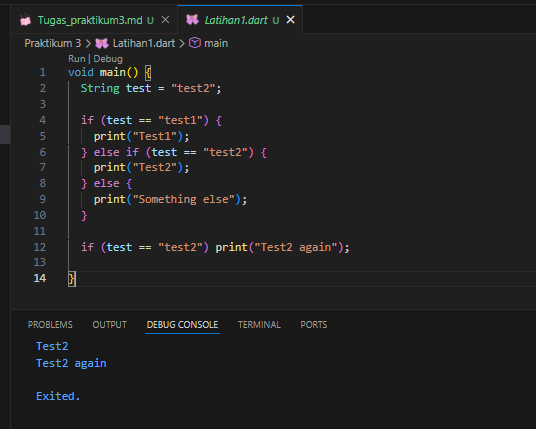
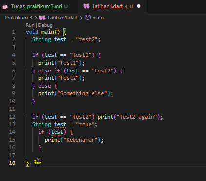
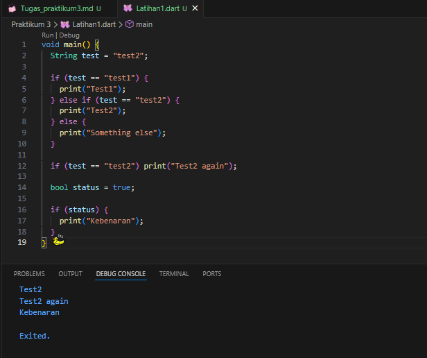
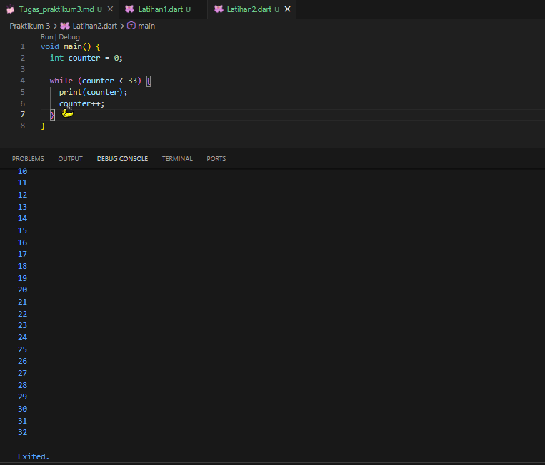
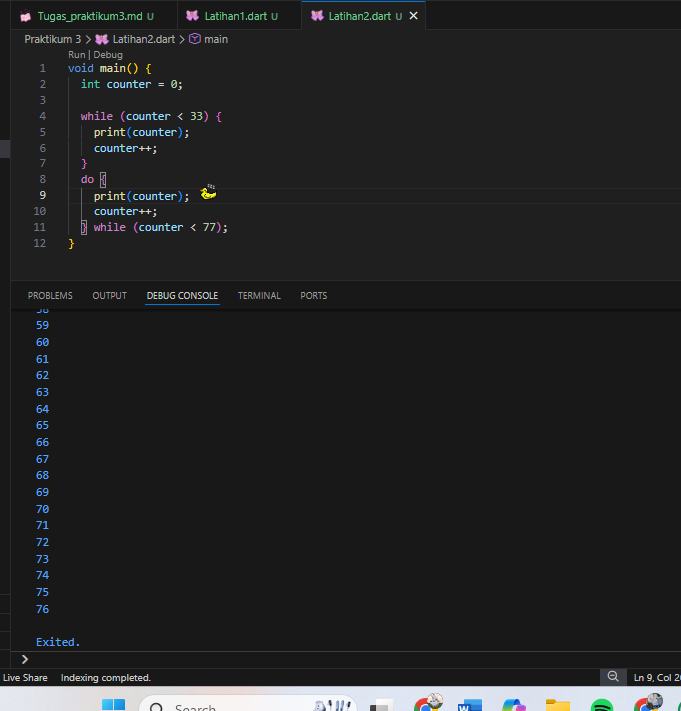
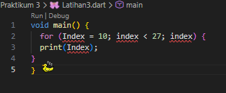
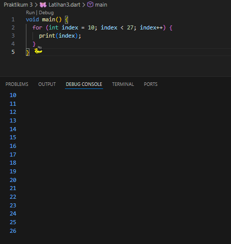
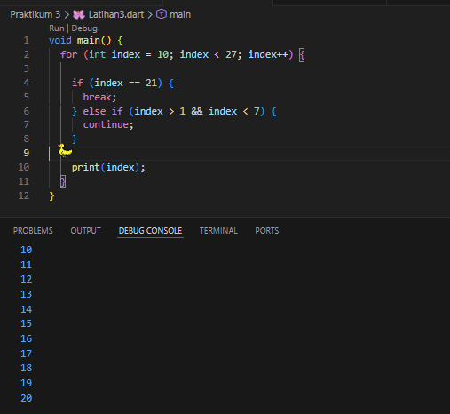
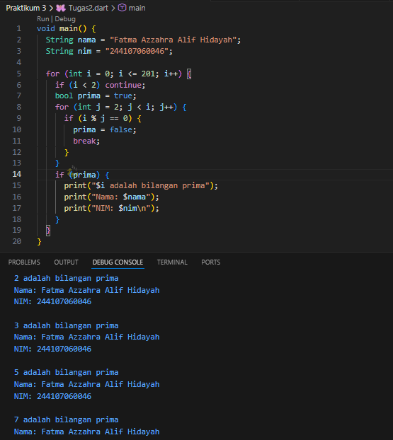

# PRAKTIKUM MOBILE 3
## Control Flow (If / Else)

Nama : FATMA AZZAHRA ALIF HIDAYAH 
NIM : 244107060046  
Kelas : SIB 2D/06  

# PRAKTIKUM 3 LATIHAN 1

## 1. Hasil Eksekusi Program (latihan 1)

Berikut adalah hasil run kode program pada latihan 1.

## 2. Jawaban

Saat kode dijalankan, program akan memeriksa nilai dari variabel `test`.  
Karena nilai `test` adalah `"test2"`, maka kondisi pada `else if (test == "test2")` bernilai benar sehingga program menampilkan **"Test2"**.  

Setelah itu terdapat pengecekan kondisi kedua yaitu `if (test == "test2")` yang juga bernilai benar, sehingga program kembali menampilkan **"Test2 again"**.

## 3. Hasil Eksekusi Program (Langkah 3)
Kode tidak bisa dijalankan karena ada eror.pertama karena sudah ada String test = "test2"; tapi dibuat lagi, kedua if (test) salah tipe data
test bertipe String, tapi if membutuhkan boolean (true / false). perbaikannya yaitu hanya deklarasi string test satu kali dan membuat deklarasi  status untuk variabel boolean  

hasil yang benar : 

# PRAKTIKUM 3 LATIHAN 2

## 2. Silakan coba eksekusi (Run) kode pada langkah 1 tersebut. Apa yang terjadi? Jelaskan! Lalu perbaiki jika terjadi error.
jawab : Saat dijalankan akan terjadi error karena variabel counter belum dideklarasikan terlebih dahulu.
Agar program bisa di run,  harus mendefinisikan variabel counter sebelum perulangan. ini perbaikan dan hasil run, program menghasilkan angka 1 hingga 32. Hal ini terjadi karena nilai awal counter = 0 lalu perulangan berjalan selama counter < 33

## 3. Tambahkan kode program berikut, lalu coba eksekusi (Run) kode Anda.
program berjalan baik, tidak eror. Program dimulai dengan membuat variabel counter bernilai 0. Kemudian program menjalankan perintah di dalam  do, yaitu mencetak nilai counter dan menambah nilainya dengan counter++.Setelah itu barulah kondisi while (counter < 77) diperiksa. Selama nilai counter masih kurang dari 77, perulangan akan terus berjalan.jadi  program akan menampilkan angka 0 sampai 76 secara berurutan.

# PRAKTIKUM 3 LATIHAN 3

## 1. Ketik atau salin kode program berikut ke dalam fungsi main().

## 2. Silakan coba eksekusi (Run) kode pada langkah 1 tersebut. Apa yang terjadi? Jelaskan! Lalu perbaiki jika terjadi error. 
Saat dijalankan akan terjadi error karena variabel index belum dideklarasikan dan penulisan huruf besar-kecil tidak konsisten (Index dan index).
Perbaikannya adalah mendeklarasikan variabel terlebih dahulu dan menggunakan penulisan yang sama. hasil dari perbaikan yaitu perulangan for akan mencetak angka mulai dari 10 sampai 26 karena kondisi perulangannya adalah index < 27.

## 3. Tambahkan kode program berikut di dalam for-loop, lalu coba eksekusi (Run) kode Anda. Apa yang terjadi ? Jika terjadi error, silakan perbaiki namun tetap menggunakan for dan break-continue. 

Program tersebut error karena penulisan kodenya tidak tepat. Variabel ditulis Index dan index, padahal Dart membedakan huruf besar dan kecil. Selain itu penulisan Else If juga salah, seharusnya else if. setelah diperbaiki dan dijalankan perulangan dimulai dari angka 10 dan berhenti ketika index = 21 karena ada perintah break. Jadi angka yang ditampilkan adalah 10 sampai 20.

# TUGAS 2 PRAKTIKUM 

## Buatlah sebuah program yang dapat menampilkan bilangan prima dari angka 0 sampai 201 menggunakan Dart. Ketika bilangan prima ditemukan, maka tampilkan nama lengkap dan NIM Anda.

