# PRAKTIKUM MOBILE 4
## COLLECTION, RECORDS, FUNCTION DART

Nama : FATMA AZZAHRA ALIF HIDAYAH 
NIM : 244107060046  
Kelas : SIB 2D/06  

# PRAKTIKUM 4 LATIHAN 1

## 1. Hasil Eksekusi Program  
hasil run : 

## 2. Apa yang terjadi? Jelaskan! 
Saat kode dijalankan, program membuat sebuah list yang berisi tiga angka yaitu [1, 2, 3]. Program kemudian mengecek apakah panjang list benar-benar 3 dan apakah nilai pada index ke-1 adalah 2 menggunakan assert. Setelah itu program menampilkan panjang list dan nilai pada index tersebut. Selanjutnya nilai pada index ke-1 diubah menjadi 1, sehingga saat dicetak kembali nilai yang muncul adalah 1.

## 3. Apa yang terjadi? Jelaskan! 
    -Index 0, 3, 4 masih null (default value)
    -Index 1 berisi nama "Fatma Azzahra Alif Hidayah"
    -Index 2 berisi NIM "244107060046
    -print(list) menampilkan seluruh array
    -print(list[1]) dan print(list[2]) menampilkan elemen spesifik

# PRAKTIKUM 4 LATIHAN 2

## 2. Hasil Run Program  
Kode berjalan sukses tanpa error. Set halogens berhasil dibuat dengan 5 elemen unik dan urutannya acak karena sifat Set yang tidak terurut. Tidak perlu perbaikan apapun.
## 3. 
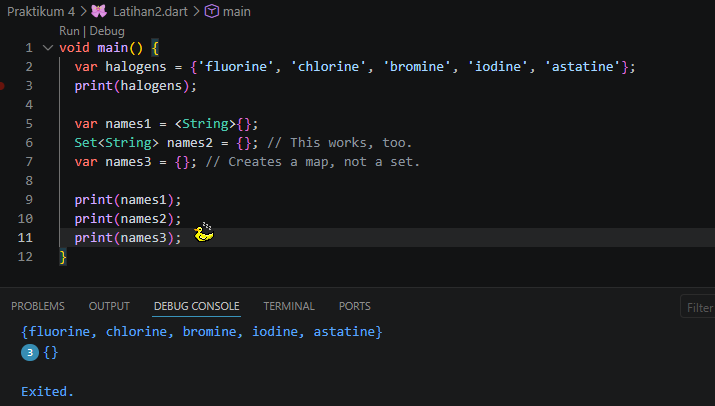
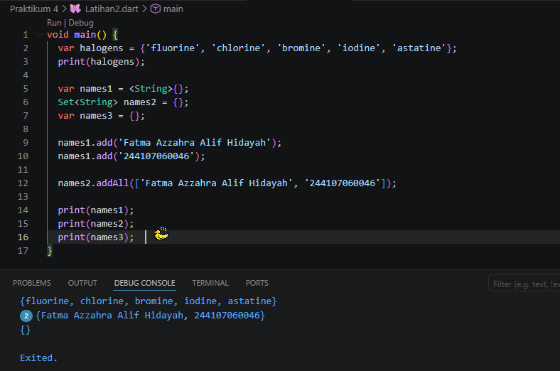

# PRAKTIKUM 4 LATIHAN 3

## 1. Hasil Run Program  
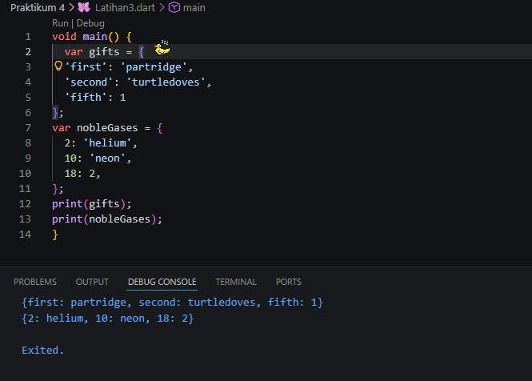
Kode berjalan sukses tanpa error. Map gifts berisi key String dengan value campur (String dan int), sedangkan nobleGases berisi key int dengan value campur juga. Urutan Map terjaga saat ditampilkan dan keduanya menunjukkan struktur key-value pair dengan benar. Tidak perlu perbaikan apapun.
## 2. Hasil Run 
Program tersebut berhasil dijalankan tanpa error dan menampilkan isi dari dua Map, yaitu gifts dan nobleGases. Map gifts berisi pasangan key bertipe String dengan value campuran (String dan integer), sedangkan nobleGases berisi key integer dengan value juga campuran. Setelah itu, kode membuat Map baru (mhs1 dan mhs2), tetapi tidak digunakan lebih lanjut. Perubahan nilai yang dilakukan tetap terjadi pada Map awal (gifts dan nobleGases), bukan pada Map baru.
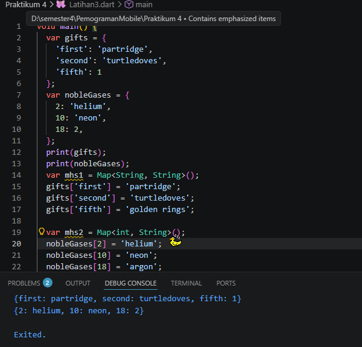

## 3. Menambahkan Nama dan NIM
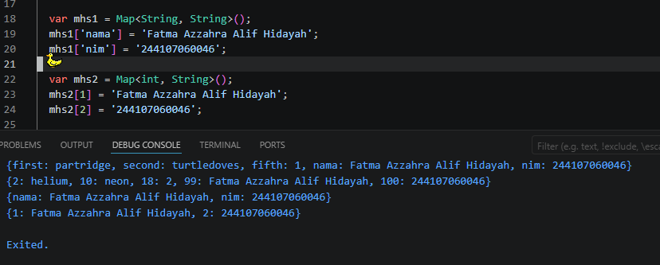

# PRAKTIKUM 4 LATIHAN 4

## 1. Hasil Run Program 
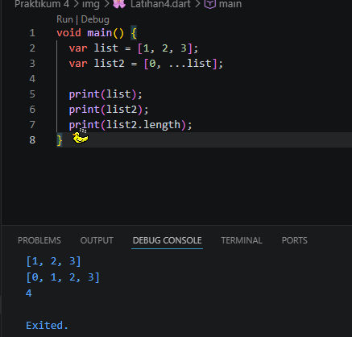

## 2. Hasil Run
Program ini membuat dua list. list berisi angka 1, 2, dan 3. Lalu list2 dibuat dengan menambahkan angka 0 di depan, dan isi dari list dimasukkan menggunakan spread operator (...). Jadi isi list2 adalah gabungan dari 0 dan semua isi list. Panjang list2 jadi 4 karena ada 4 elemen.

## 3.  
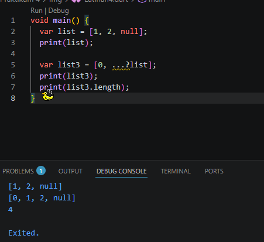
Di sini list berisi nilai null di dalamnya. Saat dimasukkan ke list3, digunakan ...?list. Tanda ...? ini artinya spread operator yang aman terhadap null. Jadi kalau list itu null, program tidak error. Tapi karena list di sini tidak null (hanya isinya ada null), maka semua isi tetap dimasukkan ke list3. Hasilnya list3 berisi 0, 1, 2, dan null dengan panjang 4.

Hasil Menggunakan NIM:
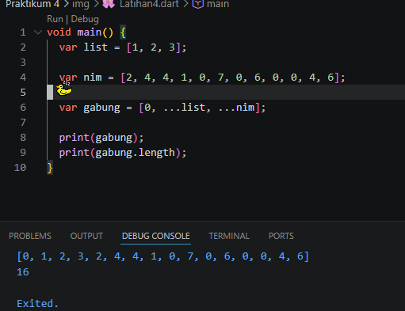

## 4. 
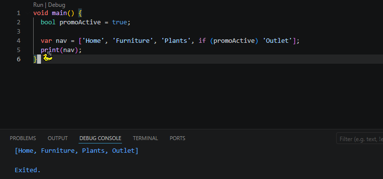
Kode ini menggunakan if di dalam list. Kalau promoActive bernilai true, maka 'Outlet' akan dimasukkan ke dalam list. Kalau false, bagian itu dilewati. Jadi isi list bisa berubah tergantung kondisi.

## 5. 
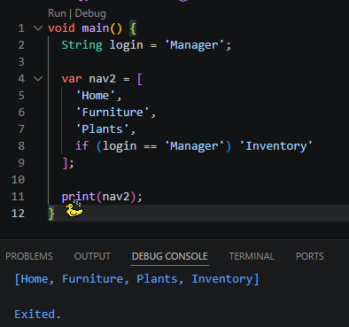
Kode awal error karena penulisan if (login case 'Manager') tidak valid di Dart. Yang benar adalah menggunakan perbandingan ==. Setelah diperbaiki, list akan menambahkan 'Inventory' hanya jika login adalah 'Manager'. Jika tidak, item tersebut tidak dimasukkan.

## 6. 
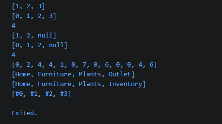
Pada langkah ini digunakan collection for, yaitu perulangan langsung di dalam list. Data dari listOfInts diambil satu per satu lalu diubah menjadi string dengan format #angka dan dimasukkan ke listOfStrings. Hasilnya adalah list baru yang berisi #0, #1, #2, dan #3.

assert digunakan untuk memastikan bahwa hasilnya benar, yaitu elemen ke-1 harus bernilai #1. Jika tidak sesuai, program akan error saat dijalankan dalam mode debug.

## Collection For :
Collection for adalah cara menulis perulangan langsung di dalam pembuatan list (atau collection lain). Jadi kita bisa mengambil data dari list lain, lalu memproses dan memasukkannya ke list baru dalam satu langkah.

Manfaat
Collection for membuat kode lebih singkat dan rapi karena tidak perlu membuat loop terpisah. Selain itu, proses pembentukan data jadi lebih jelas karena semua ditulis langsung di dalam list. Cara ini juga mengurangi kemungkinan kesalahan dibanding menulis loop manual, sehingga lebih efisien dan mudah dipahami.

# PRAKTIKUM 4 LATIHAN 3

## 2. 
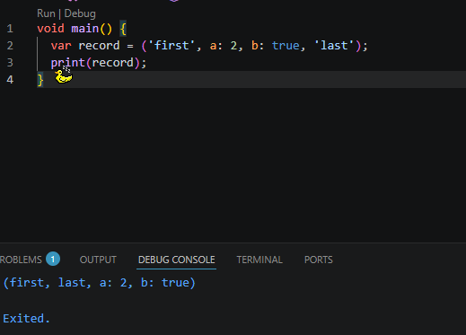
Di sini bikin record, yaitu tipe data yang bisa nyimpen beberapa nilai dalam satu variabel. Isinya campuran: ada string, angka, dan boolean. Ada yang tanpa nama (positional) dan ada yang pakai nama seperti a dan b. Saat di-print, semua isi record akan ditampilkan.

## 3.
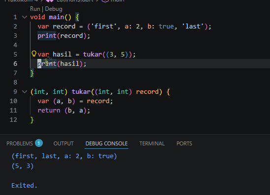
Fungsi tukar digunakan untuk menukar posisi dua nilai dalam record. Nilai pertama jadi kedua, dan sebaliknya. Ini pakai konsep destructuring, yaitu langsung memecah isi record ke variabel a dan b.

## 4.
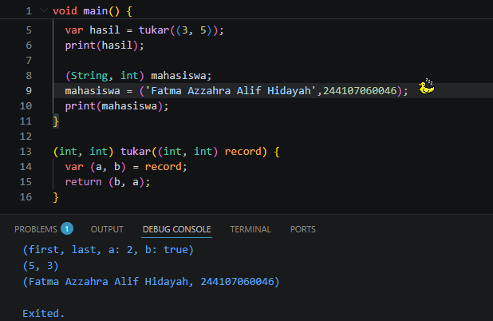
Di langkah ini  pakai type annotation untuk record, jadi tipe datanya ditulis jelas (String, int). Variabel mahasiswa menyimpan nama dan umur. Ini bikin kode lebih jelas dan aman karena tipe datanya sudah ditentukan dari awal.

## 5. 

penjelasan :
Record digunakan untuk menyimpan beberapa data dalam satu variabel
Data dalam record bisa berupa positional (tanpa nama) dan named (pakai nama)
Nilai positional diakses menggunakan $1, $2, dan seterusnya
Nilai named diakses langsung menggunakan nama seperti a dan b
Program berhasil menampilkan setiap isi record secara terpisah tanpa error
Record memudahkan pengelolaan data yang memiliki arti berbeda dalam satu variabel

# TUGAS PRAKTIKUM
1. Silakan selesaikan Praktikum 1 sampai 5, lalu dokumentasikan berupa screenshot hasil pekerjaan Anda beserta penjelasannya! Sudah 

2. Jelaskan yang dimaksud Functions dalam bahasa Dart!
jawab : Function adalah blok kode yang bisa dipanggil untuk menjalankan tugas tertentu,Digunakan supaya kode tidak berulang dan lebih terstruktur
contoh :
    int tambah(int a, int b) {
    return a + b;
    }

3. Jelaskan jenis-jenis parameter di Functions beserta contoh sintaksnya!
jawab : 
    a. Positional parameter parameter yang harus diisi sesuai urutan saat pemanggilan function.
        contoh :
        void sayHello(String nama, int umur) {
            print('$nama $umur');
        }
    b. Optional positional parameter yaitu parameter yang boleh diisi atau tidak (opsional) dan ditulis menggunakan tanda [].
        contoh : 
        void sayHello(String nama, [int? umur]) {
            print('$nama $umur');
        }
    c. Named parameter yaitu parameter yang dipanggil menggunakan nama variabelnya dan ditulis dengan tanda {}.
        contoh :
        void sayHello({String? nama, int? umur}) {
            print('$nama $umur');
        }
    d. Default parameter yaitu parameter yang memiliki nilai awal (default) jika tidak diisi saat pemanggilan.Contoh:
        void sayHello({String nama = 'Guest'}) {
            print(nama);
        }

4. Jelaskan maksud Functions sebagai first-class objects beserta contoh sintaknya!
jawab : Functions sebagai first-class objects berarti function diperlakukan seperti data. Function bisa disimpan ke dalam variabel, dikirim sebagai parameter ke function lain, dan juga bisa dikembalikan dari function. Contoh :
    void sayHi() {
        print('Hi');
        }

        void main() {
        var fungsi = sayHi;
        fungsi();
     }
Pada contoh tersebut, function sayHi disimpan ke dalam variabel fungsi, lalu dipanggil melalui variabel tersebut. Hal ini menunjukkan bahwa function bisa diperlakukan seperti objek atau nilai biasa di Dart.

5. Apa itu Anonymous Functions? Jelaskan dan berikan contohnya! 
jawab : Anonymous Function adalah function yang tidak memiliki nama dan biasanya digunakan langsung di tempat tertentu tanpa perlu didefinisikan terpisah. Function ini sering dipakai untuk operasi singkat atau sekali pakai.
Contoh:
    var list = [1, 2, 3];
    list.forEach((item) {
        print(item);
    });
Pada contoh tersebut, function (item) { print(item); } tidak memiliki nama dan langsung digunakan di dalam forEach. Hal ini membuat kode lebih ringkas tanpa harus membuat function terpisah.

6. Jelaskan perbedaan Lexical scope dan Lexical closures! Berikan contohnya!
jawab : 
    a) Lexical scope yaitu aturan bahwa suatu variabel hanya bisa diakses berdasarkan tempat penulisan kode (scope tempat variabel dibuat).contoh :
        void main() {
            var nama = 'fatma';
            void tampil() {
                print(nama);
            }
            tampil();
        } 
    Variabel nama bisa diakses di dalam fungsi tampil karena berada dalam scope yang sama (di luar tapi masih lingkupnya).

    b) Lexical closure yaitu function yang tetap menyimpan dan mengingat variabel dari scope luar meskipun function tersebut sudah dipanggil di luar scope aslinya. contoh :
        Function buatCounter() {
            int count = 0;

            return () {
                count++;
                return count;
            };
        }
            void main() {
            var counter = buatCounter();
            print(counter()); // 1
            print(counter()); // 2
        }
        Penjelasan:Variabel count tetap tersimpan walaupun function buatCounter sudah selesai dijalankan. Ini yang disebut closure

7. Jelaskan dengan contoh cara membuat return multiple value di Functions!
jawab : 
Return multiple value adalah cara mengembalikan lebih dari satu nilai dari sebuah function. Di Dart, hal ini bisa dilakukan menggunakan record.contoh :
(int, int) hitung(int a, int b) {
  return (a + b, a * b);
}

void main() {
  var hasil = hitung(2, 3);
  print(hasil.$1);
  print(hasil.$2);
}
Penjelasan:
Function hitung mengembalikan dua nilai sekaligus, yaitu hasil penjumlahan dan perkalian. Nilai tersebut diakses menggunakan $1 dan $2.

