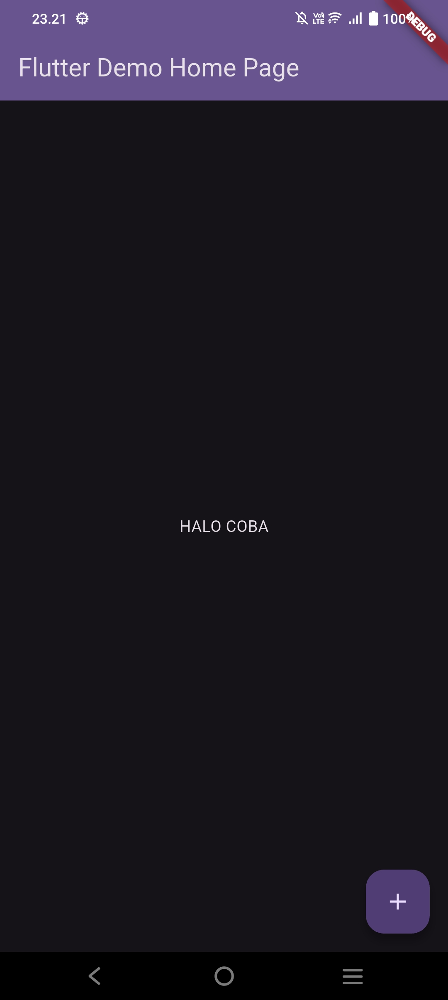
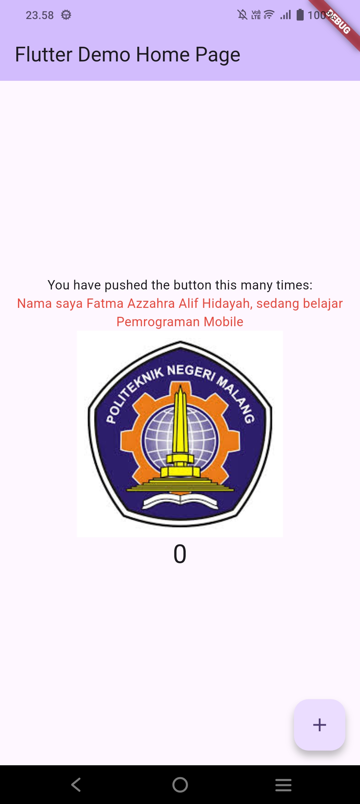
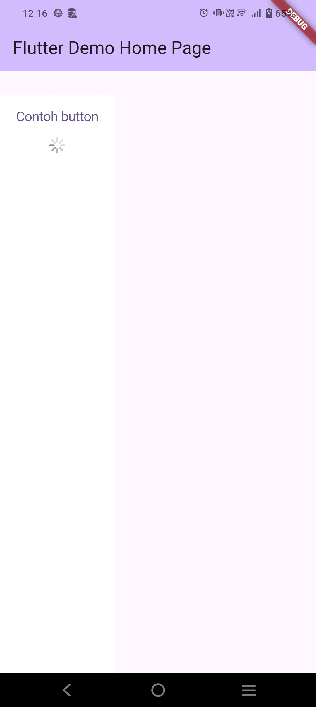
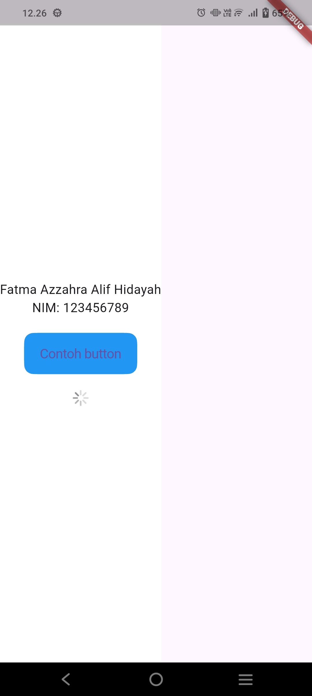

# Laporan Praktikum Pemrograman Mobile
# Jobsheet 5: First App & Widget Dasar Flutter

**Nama:** Fatma Azzahra Allif Hidayah  
**NIM:** 244107060046  
**Kelas:** SIB 2D

---

## Hasil Praktikum

### 1. Praktikum 1: Hello World dan Background Dark
**Penjelasan:** Pada tahap awal, saya mencoba membuat aplikasi Flutter dasar yang menampilkan teks "HALO COBA" di tengah layar. Saya juga mengonfigurasi tema aplikasi menjadi mode gelap (dark mode) menggunakan widget `Center` dan properti `TextStyle` untuk memberikan warna kontras pada teks.

### 2. Praktikum 2: Implementasi Image Asset (Logo Polinema)
**Penjelasan:** Langkah selanjutnya adalah menambahkan aset gambar ke dalam aplikasi. Saya memasukkan logo Politeknik Negeri Malang menggunakan widget `Image.asset`. Selain itu, saya menambahkan teks identitas diri di atas gambar dengan format warna merah untuk membedakan elemen teks pada UI.

### 3. Praktikum 3: Penggunaan Loading Indicator (CircularProgressIndicator)
**Penjelasan:** Pada praktikum ini, saya mempelajari cara menampilkan indikator proses (loading) menggunakan widget `CircularProgressIndicator`. Widget ini diletakkan di dalam `Column` untuk menunjukkan bahwa aplikasi sedang melakukan sebuah proses atau memuat data.

### 4. Praktikum 4: Gabungan Widget Text, Button, dan Loading
**Penjelasan:** Tahap akhir dari praktikum widget dasar adalah menggabungkan beberapa widget sekaligus. Saya menyusun Nama, NIM, sebuah `ElevatedButton` bertuliskan "Contoh button", dan indikator loading di bawahnya. Penggunaan widget `Column` dan `MainAxisAlignment` memastikan semua elemen tersusun rapi secara vertikal di tengah layar.

