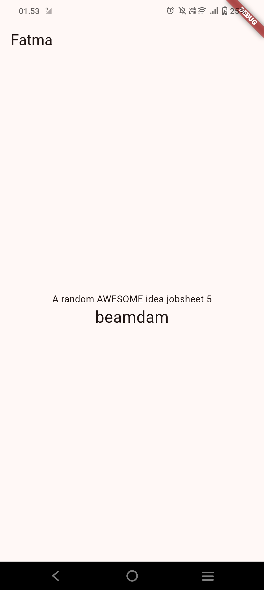
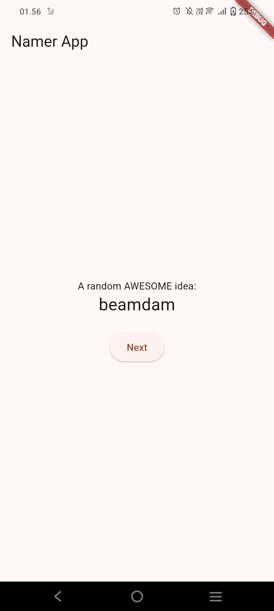
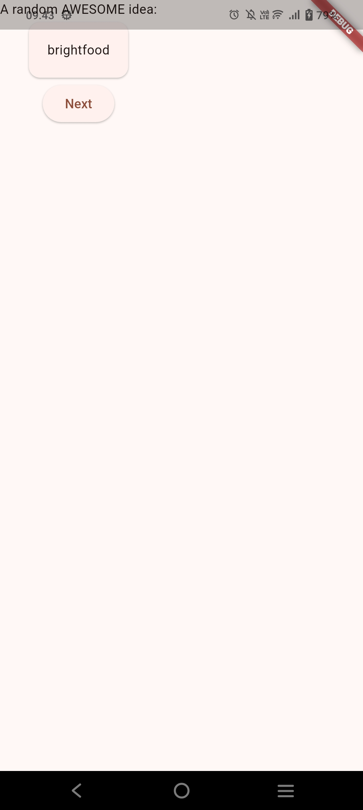
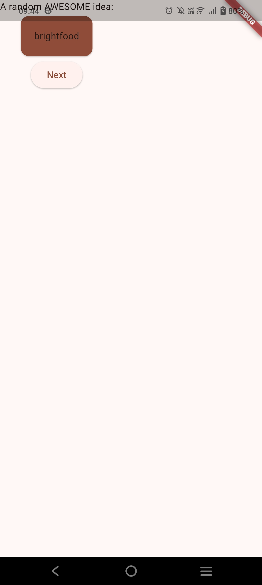
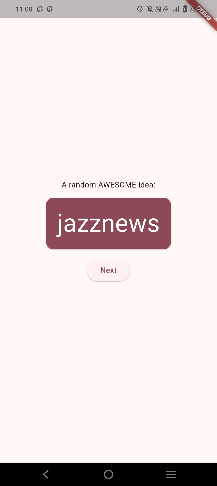
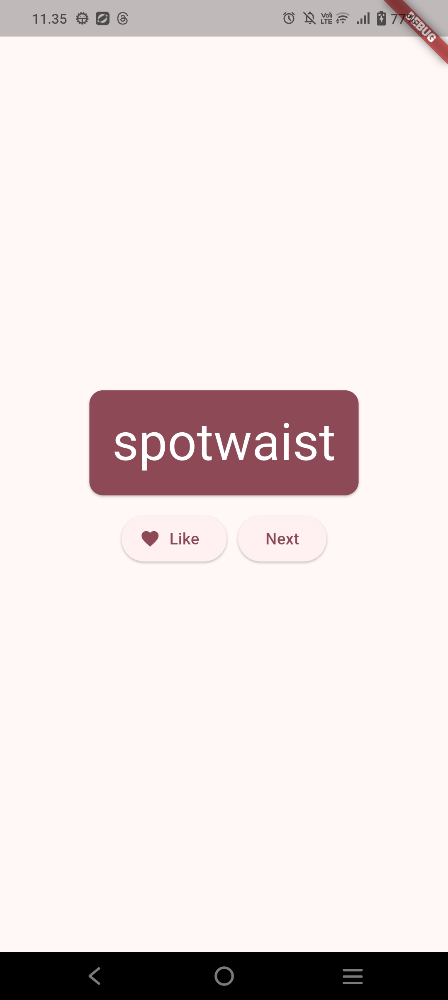
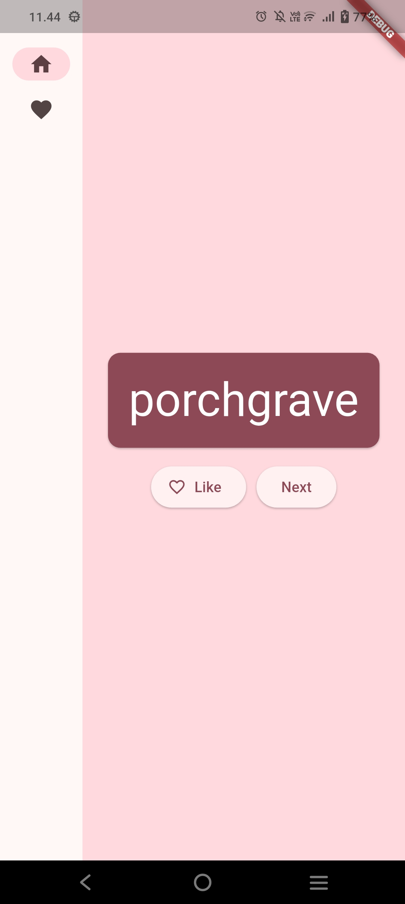
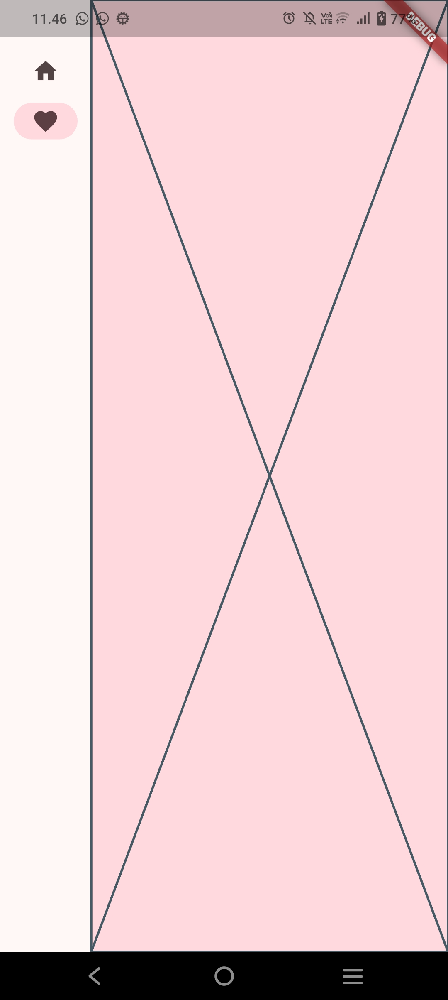
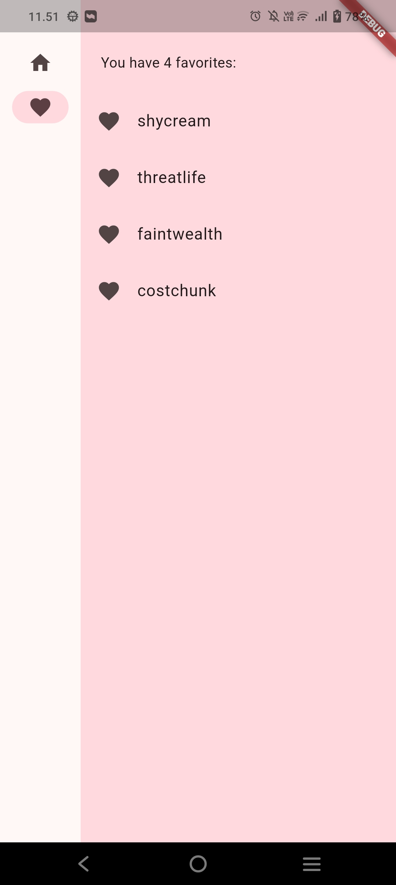

# Laporan Praktikum Pemrograman Mobile
# Jobsheet 5: Codelabs - Menulis Aplikasi Flutter Pertama Anda

**Nama:** Fatma Azzahra Allif Hidayah  
**NIM:** 244107060046  
**Kelas:** SIB 2D

---

## Hasil Praktikum (Codelabs)

### 1. Persiapan Project dan Struktur Dasar
**Penjelasan:** Langkah awal adalah menginisialisasi project Flutter baru. Di sini saya mengubah teks default dan menambahkan teks "jobsheet 5" sebagai penanda praktikum. Nama aplikasi diatur menjadi "Namer App" untuk menghasilkan kombinasi kata acak.

### 2. Menambahkan Tombol "Next"
**Penjelasan:** Saya menambahkan widget `ElevatedButton` dengan label "Next". Tombol ini berfungsi untuk memicu perubahan state, di mana setiap kali ditekan, aplikasi akan menghasilkan pasangan kata acak yang baru melalui package `english_words`.

### 3. Styling dengan BigCard (Theme & Warna)
**Penjelasan:** Agar tampilan lebih menarik, kata acak dibungkus ke dalam widget custom bernama `BigCard`. Di sini saya menerapkan tema warna menggunakan `Theme.of(context).colorScheme` sehingga warna kartu otomatis mengikuti skema warna aplikasi (coklat/terakota).

### 4. Refactoring UI dan Layouting
**Penjelasan:** Melakukan perapihan tata letak agar teks dan tombol berada di tengah layar menggunakan widget `Center` dan `Column`. Teks kata acak juga diperbesar agar lebih mudah dibaca dan memiliki kontras yang baik dengan latar belakang kartu.

### 5. Implementasi Fitur "Like"
**Penjelasan:** Saya menambahkan fungsionalitas untuk menyukai (*Like*) kata yang muncul. Terdapat tombol ikon hati di sebelah tombol "Next". State aplikasi sekarang mampu menyimpan daftar kata-kata yang disukai oleh pengguna.

### 6. Navigasi dengan NavigationRail
**Penjelasan:** Untuk meningkatkan fungsionalitas, saya menambahkan widget `NavigationRail` di sisi kiri layar. Widget ini memungkinkan pengguna berpindah antar halaman (Home dan Favorites) dengan transisi yang responsif.

### 7. Pengaturan Layout Responsif
**Penjelasan:** Mengatur agar area utama aplikasi bersifat fleksibel menggunakan widget `LayoutBuilder` dan `SafeArea`. Hal ini memastikan bahwa konten aplikasi tidak tertutup oleh notch atau elemen sistem lainnya pada perangkat mobile.

### 8. Halaman Favorites (Hasil Akhir)
**Penjelasan:** Tahap akhir adalah membuat halaman Favorites yang menampilkan daftar semua kata yang telah di-klik "Like" sebelumnya. Halaman ini menggunakan widget `ListView` untuk menampilkan daftar kata beserta ikon hati di sampingnya secara urut.

