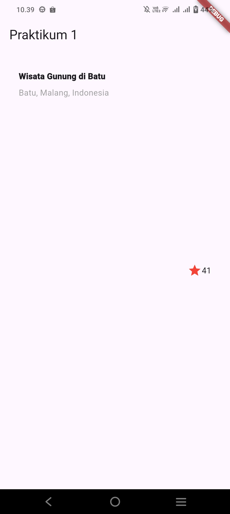
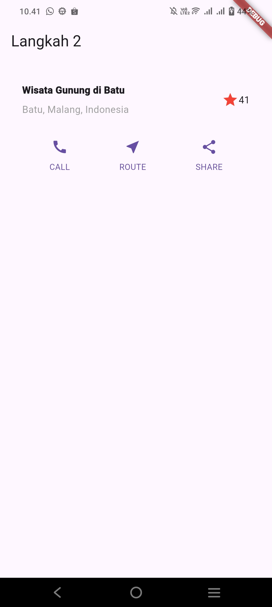
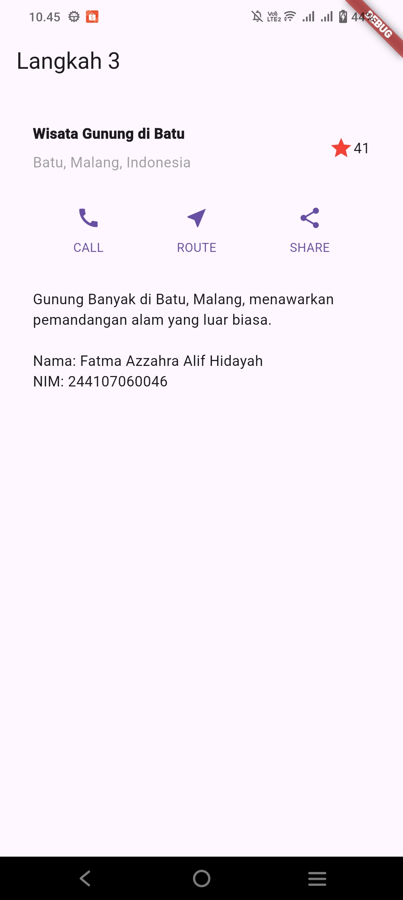
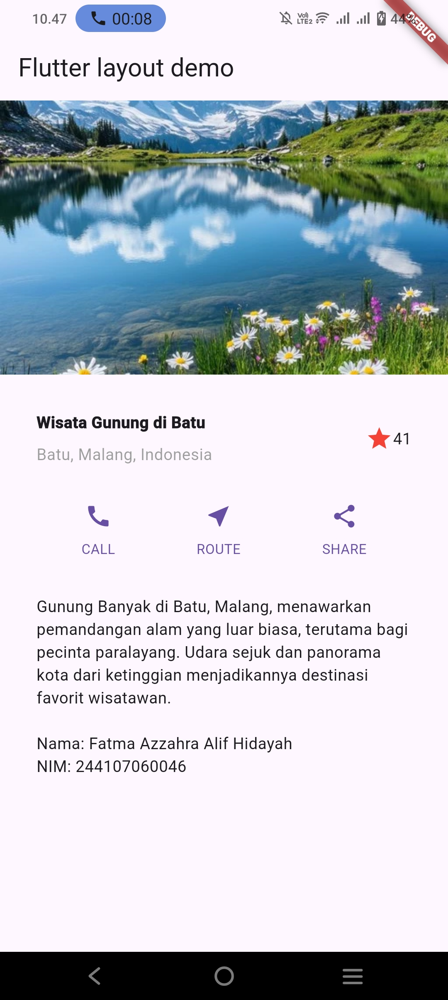

# Laporan Praktikum Pemrograman Mobile
# Jobsheet 6: Layout dan Navigasi

**Nama:** Fatma Azzahra Allif Hidayah  
**NIM:** 244107060046 
**Kelas:** SIB 2D

---

## Hasil Praktikum

### 1. Praktikum 1: Membangun Layout di Flutter
Pada praktikum ini, dilakukan penyusunan struktur dasar layout menggunakan widget Column dan Row untuk membentuk kerangka aplikasi yang rapi.

### 2. Praktikum 2: Implementasi Button Row
Bagian ini fokus pada pembuatan baris tombol (button row) yang interaktif menggunakan widget custom yang menggabungkan icon dan teks.

### 3. Praktikum 3: Implementasi Text Section
Implementasi bagian teks yang berisi deskripsi panjang. Menggunakan padding agar teks tidak menempel ke pinggir layar sehingga menjaga estetika desain.

### 4. Praktikum 4: Implementasi Image Section
Menambahkan aset gambar ke dalam project. Langkah ini melibatkan konfigurasi pada file `pubspec.yaml` agar folder `images/` dapat dibaca oleh Flutter.

