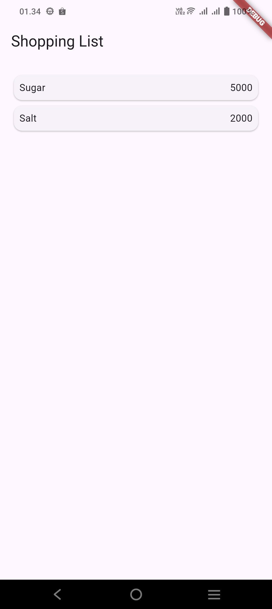
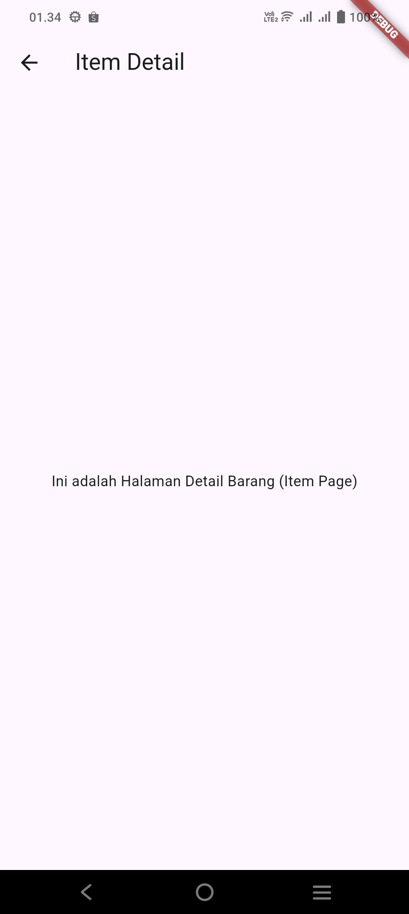
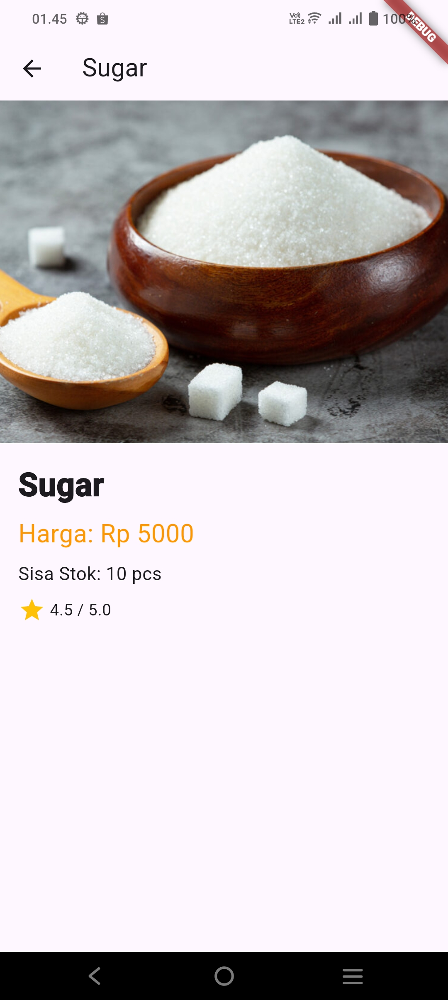
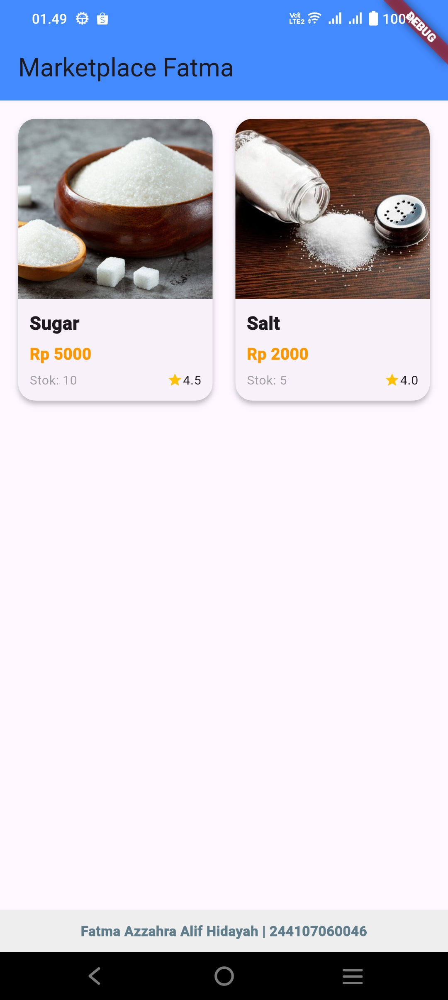

# Laporan Praktikum Pemrograman Mobile
# Jobsheet 6: Tugas Praktikum 2 (Navigasi dan Rute)

**Nama:** Fatma Azzahra Allif Hidayah  
**NIM:** 244107060046  
**Kelas:** SIB 2D

---

## Hasil Tugas Praktikum 2

### 1. Pengiriman Data melalui Navigator Arguments
**Penjelasan:** Tugas ini meminta untuk menambahkan informasi data (objek item) ke dalam properti `arguments` saat melakukan navigasi menggunakan `Navigator.pushNamed`. Tujuannya agar data dari halaman utama bisa dipassing ke halaman tujuan.

### 2. Pembacaan Data menggunakan ModalRoute
**Penjelasan:** Pada tahap ini, dilakukan pengambilan data yang telah dikirim tadi di halaman tujuan (`ItemPage`). Data diambil menggunakan fungsi `ModalRoute.of(context)` agar bisa ditampilkan di layar detail.

### 3. Implementasi GridView dan Atribut Produk
**Penjelasan:** Mengubah tampilan daftar produk yang awalnya list memanjang menjadi bentuk kotak-kotak (Grid). Selain itu, setiap produk ditambahkan atribut pendukung seperti foto, stok, dan rating.

### 4. Implementasi Hero Widget
**Penjelasan:** Menerapkan widget `Hero` pada bagian foto produk. Widget ini memberikan efek animasi transisi yang halus saat gambar diklik dan berpindah halaman.

### 5. Modifikasi UI dan Footer Identitas
**Penjelasan:** Mempercantik tampilan aplikasi agar lebih menarik dan menambahkan informasi **Nama** serta **NIM** pada bagian bawah (footer) aplikasi sebagai tanda kepemilikan karya.

